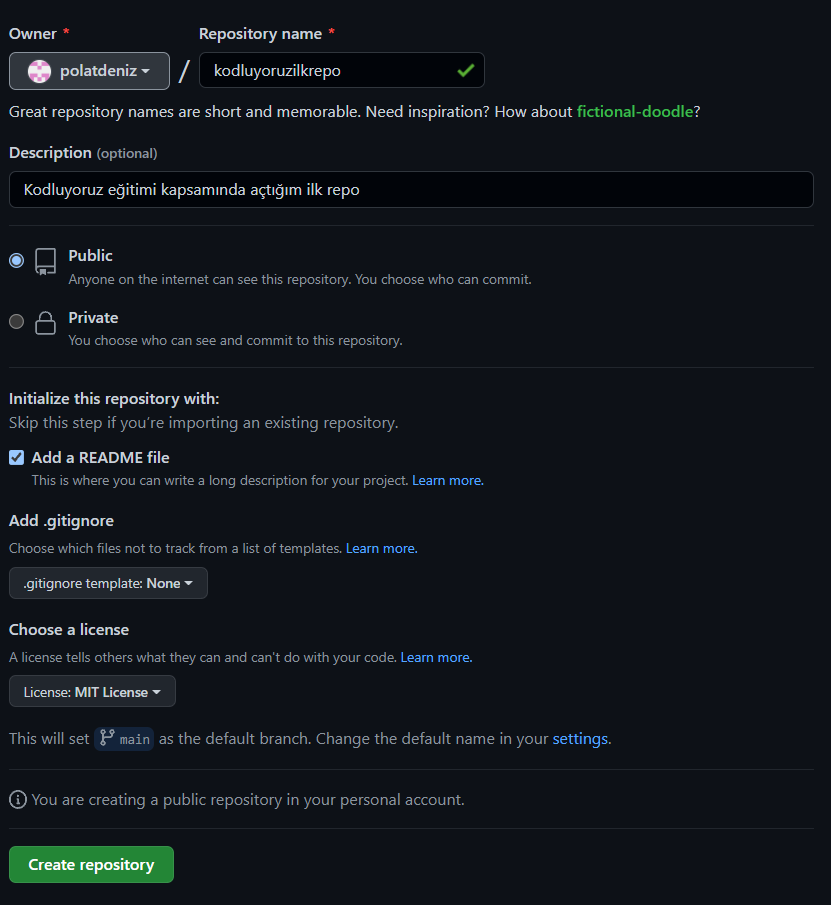

# Kodluyoruz Ilk Repo
Bu repo [Kodluyoruz](https://www.kodluyoruz.org/) Back-end eğitiminde oluşturduğumuz ilk repo. İçerisinde bir adet README dosyası, bir adet de index.html barındırıyor.



# Installation 
[Öncelikle projeyi clonlayın.](https://github.com/polatdeniz/kodluyoruzilkrepo)

```
git clone https://github.com/polatdeniz/kodluyoruzilkrepo.git
```

# Usage
Projeyi cloneladıktan sonra Visual Studio Code programinda açiniz.

Linux için:

```
cd kodluyoruzilkrepo
code .
```

# Contributing
Pull requestler kabul edilir. Büyük değişiklikler için, lütfen önce neyi değiştirmek istediğinizi tartışmak için bir konu açınız.


# License
[MIT](https://choosealicense.com/licenses/mit/)
